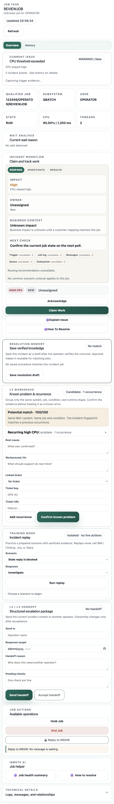

# UI-03 compact independent job task window

Issue: [#59](https://github.com/iNewTech/iMonitor/issues/59)
Design contract: [UI_DESIGN.md](../../UI_DESIGN.md)
Project: [AI + ActionBoard](https://github.com/orgs/iNewTech/projects/8)

The shipped task window keeps the operator's job context in one compact native window. **Overview** contains the current issue, response brief, workflow, AI helper, runbook, Resolution Memory, L3 recurrence, replay, handoff, and eligible job actions. **History** is the only other persistent tab. Technical logs, messages, and resource relationships are available through the expandable **Technical details** section.

Opening the same qualified job focuses its existing window. Opening a different qualified job creates another window, so an operator can compare two incidents without losing either context. The window starts at 720×680 native pixels and reflows down to 560×460.

## Evidence

The focused Electron review suite covers:

- same-job window reuse and different-job coexistence;
- two-tab keyboard navigation and contextual section visibility;
- technical-details disclosure;
- action, AI, runbook, handoff, history, refresh-race, error, and confirmation behavior;
- minimum-window reflow at 560×460;
- saved theme application before task content is shown.

The screenshot uses isolated demo data. It demonstrates layout and interaction only; it is not evidence of live IBM i access or external ticket deployment.
